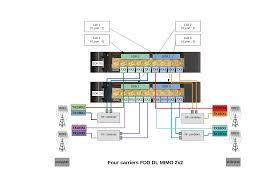
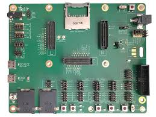
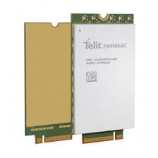
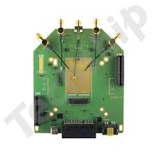
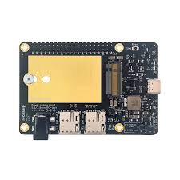
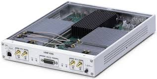

# Equipamentos do Laboratório de 5G Open RAN

Este documento descreve os equipamentos disponíveis no laboratório para o desenvolvimento, testes e simulações de redes móveis 5G usando Open RAN.

## Lista de Equipamentos

### 1. Amarisoft

- **Descrição**: Amarisoft é uma solução de software para redes 4G e 5G, oferecendo suporte para a implementação de uma infraestrutura de rede móvel completa.
- **Função**: Usado para emular e controlar elementos de rede 5G, como a Unidade de Distribuição (DU), Unidade Central (CU), e elementos da interface de rádio.
- **Aplicações**: Ideal para testes de rede 5G e simulações de RAN em ambiente de laboratório.
- **Referência**: <https://amarisoft.com>

### 2. Amarisoft Ultimate

- **Descrição**: Versão avançada do software Amarisoft, com funcionalidades adicionais para a análise de rede e otimização de desempenho.
- **Função**: Permite testes mais detalhados e de alto desempenho, além de simulações avançadas para ambientes de alta densidade de usuários.
- **Aplicações**: Usado para experimentos complexos que exigem alto tráfego e análise de desempenho.
- **Referência**: <https://www.amarisoft.com/test-and-measurement/device-testing/device-products/amari-callbox-ultimate>

### 3. AMARI RF2

- **Descrição**: Um equipamento de rádio projetado para suportar múltiplas frequências e bandas de rede, compatível com os padrões de rede 5G.
- **Função**: Facilita a comunicação com dispositivos 5G, sendo essencial para testes de conectividade e desempenho de rádio.
- **Aplicações**: Principalmente usado para emulação de redes 5G e experimentos de RAN abertos.
- **Referência**: <https://tech-academy.amarisoft.com/appnote_fr2.doc>

### 4. Telit Cinterion EVB 2.0 Evaluation Kit

- **Descrição**: Kit de avaliação da Telit para módulos de comunicação 5G e LTE, permitindo a conexão e teste de dispositivos de IoT.
- **Função**: Avaliação e desenvolvimento de soluções de IoT com conectividade 5G e LTE.
- **Aplicações**: Perfeito para experimentação de IoT em redes 5G, testes de conectividade e desenvolvimento de aplicações.
- **Referência**: <https://www.telit.com/support-tools/development-evaluation-kits/evb2-0/>

### 5. Telit FN990A40 5G sub6 M.2

- **Descrição**: Módulo M.2 compatível com redes 5G sub-6 GHz, projetado para integração em sistemas de IoT e comunicações.
- **Função**: Permite a conexão de dispositivos a redes 5G sub-6 GHz, com suporte para altas velocidades de dados e baixa latência.
- **Aplicações**: Usado em aplicações de IoT e comunicação industrial que requerem conectividade 5G confiável e de alto desempenho.
- **Referência**: <https://www.telit.com/devices/fn990axx/>

### 6. Telit FN990 Interface TLB (sem módulo)

- **Descrição**: Placa de interface para o módulo FN990, necessária para a integração e testes de dispositivos com o módulo Telit FN990.
- **Função**: Proporciona uma interface para conectar o módulo FN990 a outros dispositivos para testes e desenvolvimento.
- **Aplicações**: Facilitador de conectividade para testes e desenvolvimento de dispositivos IoT que utilizam o módulo Telit FN990.
- **Referência**: <https://techship.com/product/telit-fn990-interface-tlb-wo-module/?variant=003>

### 7. Techship MC201 Adapter

- **Descrição**: Adaptador MC201 da Techship, usado para interfaces M.2 em testes de rede.
- **Função**: Fornece uma plataforma de teste para módulos de comunicação, especialmente para aqueles projetados para conectividade 5G.
- **Aplicações**: Essencial para integrar e avaliar módulos de comunicação em ambientes de teste de laboratório.
- **Referência**: <https://techship.com/products/adapter-cards/techship-adapters/?page=1>

### 8. Ettus USRP X310

- **Descrição**: O Ettus USRP X310 é uma plataforma de rádio definido por software (SDR) de alto desempenho, projetada para o desenvolvimento e implementação de sistemas de comunicação sem fio de última geração.
- **Função**: Permite a criação de protótipos e testes em sistemas sem fio avançados, oferecendo alta precisão e desempenho através de seu FPGA Kintex-7 e suporte a interfaces de alta velocidade, como PCIe e 10 Gigabit Ethernet.
- **Aplicações**: Usado em pesquisa de redes celulares, testbeds de Massive MIMO, inteligência de sinais, radar passivo e monitoramento espectral, entre outros.
- **Referência**: <https://www.ettus.com/all-products/X310-KIT/>
