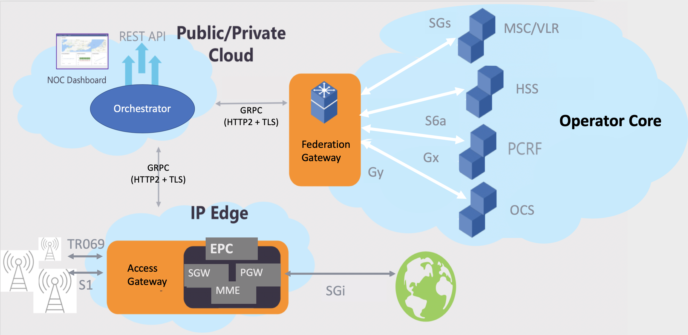

# Magma Installation Guide 🛠️

This document provides a step-by-step guide to install and develop with Magma on a local machine or cloud infrastructure. For specific information about testing the software, refer to [setting magma with scripts](./code/scripts/setup_magma.md).

## 0. Introduction


**Magma** is an **open-source** project designed to provide a flexible, scalable, and cloud-native core network solution for mobile operators and private networks.

The project was initially developed by Facebook (now **Meta**) and currently maintained by the **Linux Foundation**. It was created to provide a **distributed mobile network core solution** based on software, enabling the deployment of LTE, 5G, and Wi-Fi networks in a flexible and scalable manner.

It stands out as a **cloud-native** alternative for mobile networks, allowing operators, enterprises, and communities to build their own telecommunications infrastructures without relying exclusively on traditional **vendors**.

This repository documents the team progress, experiments, and findings while deploying and configuring Magma for LTE/4G and 5G networks.

---

### **🚀 Key Features of Magma**

1️⃣ **Distributed Mobile Core**  

- Magma implements a **4G/5G core network** that can be used for both public and private networks.  
- Supports **LTE (EPC - Evolved Packet Core) and 5G Core (5GC)**.  
- Allows integration with **Wi-Fi networks and unlicensed spectrum technologies**.  

2️⃣ **Cloud-Based Orchestration and Automation**  

- Centralized management via the **Orchestrator**, enabling real-time monitoring and control of the network.  
- Supports **deployment in public cloud environments (AWS, Azure, GCP) or on-premises**.  

3️⃣ **O-RAN Compatibility**  

- Facilitates integration with **O-RAN architectures** and **disaggregated network equipment**.  
- Supports **private 5G networks, Fixed Wireless Access (FWA), and community networks**.  

4️⃣ **Low Cost and High Flexibility**  

- Reduces dependency on **proprietary infrastructures**.  
- Enables the creation of **mobile networks in remote or hard-to-reach areas**.  

---

### **🔗 Magma Architecture**

Magma consists of three main components:

1️⃣ **Access Gateway (AGW)** 🏗️  

- Acts as the **local core network** for mobile connectivity.  
- Ensures connectivity between **User Equipment (UEs)** and the **operator’s central core**.  
- Supports **EPC (4G) and 5GC (5G)**.  

2️⃣ **Orchestrator** 🌐  

- A **cloud-based platform** for **centralized network management**.  
- Provides **monitoring, provisioning, and user policy control**.  
- Offers a **web-based interface** for simplified administration.  

3️⃣ **Federated Gateway (FeG)** 🔄  

- Enables integration with **traditional Mobile Network Operators (MNOs)** and supports **roaming**.  
- Acts as a **proxy** for existing networks, improving interoperability.  

---

### **🔹 Use Cases for Magma**

🔹 **Private 4G/5G Networks** → Enterprises and industries can build private mobile networks for IoT, automation, and internal connectivity.  
🔹 **Regional Operators and ISPs** → Smaller operators can offer **cost-effective mobile and internet services**.  
🔹 **Community Networks and Remote Areas** → Enables mobile network deployment in regions lacking traditional infrastructure.  
🔹 **Public Wi-Fi Providers** → Supports hybrid Wi-Fi/LTE networks.  




---

## 1. Prerequisites

### 🔹 System Requirements

* Ubuntu 20.04 LTS (recommended)
* Minimum: 4GB RAM (8GB recommended)
* Minimum: 50GB disk space

### 🔹 Required Packages

#### Step 1: Update the System

```bash
sudo apt update && sudo apt upgrade -y
sudo reboot
```

#### Step 2: Install Docker and Docker Compose

```bash
sudo apt update
sudo apt-get install docker-ce docker-ce-cli containerd.io docker-buildx-plugin docker-compose-plugin
```

Add user to docker group:

```bash
sudo usermod -aG docker $USER
newgrp docker
```

Verify installation:

```bash
docker --version
docker run hello-world
docker-compose --version
```

#### Step 3: Install VirtualBox

```bash
sudo apt install -y virtualbox
virtualbox --help
```

#### Step 4: Install Vagrant

```bash
wget -O - https://apt.releases.hashicorp.com/gpg | sudo gpg --dearmor -o /usr/share/keyrings/hashicorp-archive-keyring.gpg
echo "deb [arch=$(dpkg --print-architecture) signed-by=/usr/share/keyrings/hashicorp-archive-keyring.gpg] https://apt.releases.hashicorp.com $(lsb_release -cs) main" | sudo tee /etc/apt/sources.list.d/hashicorp.list
sudo apt update && sudo apt install vagrant
vagrant --version
```

#### Step 5: Validate Installation

```bash
docker --version
docker compose version
virtualbox --help
vagrant --version
```

Additional:

```bash
sudo apt install -y git docker.io docker-compose python3-pip
```

### 🔹 Installation Options

* [Deploy Installation Guide](https://magma.github.io/magma/docs/lte/deploy_install)
* Clone Magma repository:

```bash
git clone https://github.com/magma/magma.git
cd magma
```

* Create temporary folder:

```bash
sudo mkdir -p /tmp/magma_orc8r_build
sudo chmod 777 /tmp/magma_orc8r_build
```

---

## 2. Deploying Magma Orchestrator (Local with Docker)

### Step 1: Navigate to Orchestrator Directory

```bash
cd orc8r/cloud/docker
```

Create `.env` file:

```bash
nano .env
PWD=/home/{your-user}/magma/orc8r/cloud/docker
```

### Step 2: Start Services

```bash
docker-compose up -d
```

### Step 3: Check Containers

```bash
docker ps
```

Check for: `orc8r-controller`, `orc8r-nginx`, `orc8r-postgres`

### Step 4: Access Web UI

* [http://localhost:8080](http://localhost:8080)
* Default Credentials:

  * Username: `admin`
  * Password: `password`

---

## 3. Deploying the Access Gateway (AGW)

### Step 1: Install Dependencies

```bash
sudo apt update && sudo apt install -y python3-pip
```

### Step 2: Run AGW Install Script

```bash
curl -sSL https://raw.githubusercontent.com/magma/magma/master/lte/gateway/deploy/agw_install.sh | bash
```

### Step 3: Configure Gateway

```bash
sudo nano /etc/magma/configs/gateway.mconfig
```

Update with Orchestrator IP and configs.

### Step 4: Restart Services

```bash
sudo service magma@* restart
```

---

## 4. Testing and Debugging

### Service Status

```bash
sudo systemctl status magma@mme
```

### View Logs

```bash
sudo journalctl -fu magma@mme
```

### Restart Orchestrator

```bash
cd orc8r/cloud/docker
docker-compose restart
```

---

## 5. Additional Resources

* [Magma GitHub](https://github.com/magma/magma)
* [Official Documentation](https://docs.magmacore.org)
* [Installation Guide](https://docs.magmacore.org/docs/basics/installation)

---

## 6. Troubleshooting

### Infinite Reboot Loop (AGW)

#### Step 1: Stop Automatic Reboot

**Method 1: GRUB Recovery Mode**

1. Enter GRUB (Esc/Shift on boot).
2. Choose Recovery Mode > Root Shell.
3. Disable service:

```bash
systemctl disable agw_installation
reboot
```

**Method 2: Emergency Mode**

1. Edit boot entry in GRUB: add `systemd.unit=emergency.target`
2. Boot and disable service:

```bash
systemctl disable agw_installation
reboot
```

#### Step 2: Diagnose

```bash
journalctl -b -1 -n 50 --no-pager
sudo systemctl status agw_installation
dmesg | grep -i error
cat /var/log/syslog | grep reboot
```

#### Step 3: Fix Instability

| Issue                           | Solution                                 |
| ------------------------------- | ---------------------------------------- |
| agw\_installation causes reboot | Disable the service, remove it           |
| Interface issues                | Edit `/etc/network/interfaces` correctly |
| Kernel panic                    | Boot using older kernel                  |
| fstab errors                    | Comment problematic lines                |

---

## Updating Docker Compose

### Step 1: Check Version

```bash
docker-compose version
docker compose version
```

### Step 2: Remove Old Version

```bash
sudo apt remove docker-compose -y
sudo rm /usr/local/bin/docker-compose
```

### Step 3: Install Latest Version

```bash
sudo curl -L "https://github.com/docker/compose/releases/latest/download/docker-compose-$(uname -s)-$(uname -m)" -o /usr/local/bin/docker-compose
sudo chmod +x /usr/local/bin/docker-compose
```

### Step 4: Verify

```bash
docker-compose version
docker compose version
```

### Step 5: Create Symlink (optional)

```bash
sudo ln -s /usr/local/bin/docker-compose /usr/bin/docker-compose
```

---

## 🚀 Conclusion

With all steps completed, you now have a fully working Magma Orchestrator and AGW deployment. You can proceed with LTE/5G testing and explore further functionalities.

Refer to Magma documentation and community forums for continued support and best practices.
